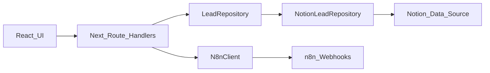
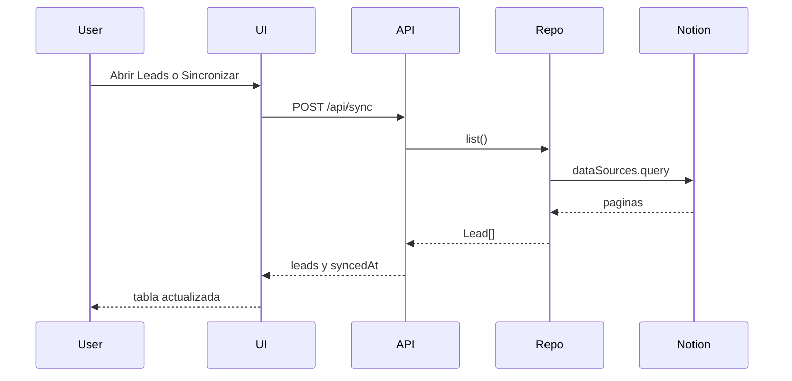
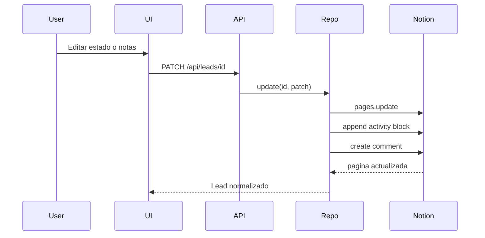

# Arquitectura

## Resumen

Leads_CRM es una aplicación Next.js con App Router. Notion es la fuente de verdad y el navegador nunca recibe el token de Notion.



## Principios

- **Notion como fuente de verdad:** no existe una base de datos local o Supabase.
- **Adaptador reemplazable:** la UI depende del modelo `Lead`, no del formato de Notion.
- **Secretos en servidor:** el cliente llama a `/api/*`.
- **Una sola operación de estado:** lista, panel y acciones masivas persisten los mismos 9 valores.
- **Errores visibles:** la sincronización y las mutaciones muestran errores mediante toast/estado.
- **Archivo reversible:** eliminar en la UI archiva la página de Notion.

## Capas

### Presentación

Ubicación: `src/app`, `src/components` y `src/store`.

- `src/app/layout.tsx`: layout raíz.
- `src/components/providers.tsx`: tema, React Query, toast y shell.
- `src/components/layout/app-sidebar.tsx`: navegación.
- `src/components/layout/topbar.tsx`: sincronización y selector de tema.
- `src/components/leads/leads-page-client.tsx`: coordinación de la pantalla Leads.
- `src/components/leads/lead-table.tsx`: tabla, selección, orden e inline status.
- `src/components/leads/lead-filters.tsx`: búsqueda y filtros combinables.
- `src/components/leads/lead-drawer.tsx`: detalle y edición.
- `src/components/leads/bulk-action-bar.tsx`: estado, favorito y archivo masivos.
- `src/store/ui-store.ts`: estado de interfaz persistido.

### Dominio

Ubicación: `src/lib/domain/lead.ts`.

El modelo `Lead` contiene información empresarial, contactos, estado CRM, email, score, favorito y metadatos técnicos. La lista `LEAD_STATUSES` es la referencia en código:

1. Nuevo
2. Pendiente revisar
3. Validado
4. Email preparado
5. Email enviado
6. Respondió
7. Reunión
8. Cliente
9. Descartado

`normalizeStatus` mantiene compatibilidad de lectura con los valores históricos:

- `Pendiente` → `Pendiente revisar`
- `Contactado` → `Email enviado`
- `Contratado` → `Cliente`

Toda escritura usa los estados vigentes.

### Persistencia

Ubicación:

- `src/lib/repository/lead-repository.ts`
- `src/lib/notion/client.ts`
- `src/lib/notion/mapper.ts`
- `src/lib/notion/notion-lead-repository.ts`

`LeadRepository` define las operaciones que necesita el producto. `NotionLeadRepository` implementa ese contrato mediante `@notionhq/client`.

El mapper:

- transforma propiedades Notion en `Lead`;
- normaliza ciudades;
- convierte emails HTML-ish a texto plano;
- transforma un `LeadPatch` en propiedades Notion;
- actualiza `Última actualización` en cada escritura.

### Integración n8n

Ubicación: `src/lib/n8n/client.ts`.

La capa reconoce cuatro acciones:

- `buscar_leads`
- `analizar_lead`
- `generar_email`
- `ejecutar_workflow`

Leads_CRM no modifica el workflow existente. Solo expone un cliente servidor preparado para URLs de webhook configuradas mediante variables de entorno.

### Autenticación

Ubicación:

- `src/lib/auth.ts`
- `src/middleware.ts`

En local, `AUTH_DISABLED=true` crea una sesión local lógica y no muestra login. El middleware deja preparado el punto de extensión para una cookie/JWT futura.

No hay equipos, roles, organizaciones ni multi-tenancy.

## Flujo de lectura



La pantalla Leads sincroniza al montar. El botón `Sincronizar` permite repetir la lectura manualmente.

## Flujo de escritura



El comentario de Notion se intenta crear sin bloquear la actualización principal si la integración no tiene capacidad de comentarios.

## Notas largas

`Observaciones` conserva los primeros 2000 caracteres. El excedente se almacena como bloques bajo el encabezado `Notas` en el cuerpo de la página.

Al abrir un lead individual, el repositorio combina ambos segmentos para editar el texto completo.

## Actividad

Los eventos se escriben como párrafos bajo el encabezado `Actividad`, con formato:

```text
[fecha ISO] (tipo_evento) mensaje
```

La timeline del drawer interpreta ese formato y presenta los eventos en orden cronológico inverso.

## Estado cliente

Zustand guarda:

- lead abierto;
- selección de filas;
- filtros;
- visibilidad de columnas;
- estado y hora de sincronización;
- copia en memoria de los leads.

Solo filtros y visibilidad de columnas se persisten en `localStorage`. Notion sigue siendo la fuente de verdad.

## APIs

- `GET /api/leads`: lista y filtra leads.
- `POST /api/leads`: crea un lead manual (validación de campos; estado `Nuevo`, origen `Manual`).
- `PATCH /api/leads`: actualización masiva secuencial.
- `GET /api/leads/:id`: detalle, overflow de notas y actividad.
- `PATCH /api/leads/:id`: actualización parcial.
- `DELETE /api/leads/:id`: archiva.
- `POST /api/sync`: recupera todos los leads activos.
- `GET /api/settings/status`: estado de configuración sin secretos.
- `GET /api/automations/:action`: lista la configuración n8n.
- `POST /api/automations/:action`: ejecuta el webhook configurado.

## Estructura principal

```text
.
├─ docs/
├─ src/
│  ├─ app/
│  │  ├─ api/
│  │  ├─ leads/
│  │  └─ ...
│  ├─ components/
│  │  ├─ layout/
│  │  ├─ leads/
│  │  └─ ui/
│  ├─ lib/
│  │  ├─ domain/
│  │  ├─ geo/
│  │  ├─ leads/
│  │  ├─ n8n/
│  │  ├─ notion/
│  │  └─ repository/
│  └─ store/
└─ .env.example
```

## Evolución prevista

Una futura fuente de datos debe implementar `LeadRepository`. La UI y los route handlers no deberían importar tipos propios de ese proveedor.
