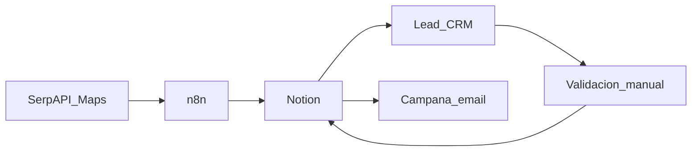

# Contexto de negocio

## Propósito

El proyecto busca construir un sistema de prospección comercial para una agencia especializada en automatización e inteligencia artificial.

Leads_CRM no es un directorio genérico de empresas. Es la interfaz de trabajo para:

1. recibir leads encontrados por el flujo de captación;
2. revisar la información disponible;
3. entender la empresa y sus posibles necesidades;
4. priorizarla;
5. preparar el contacto comercial;
6. controlar el avance hasta convertirla en cliente o descartarla.

La promesa comercial de la agencia es:

> Ayudar a asesorías y gestorías a reducir tiempo y costes mediante automatización e inteligencia artificial.

El posicionamiento vende resultados —menos trabajo manual, menos errores y procesos más ágiles—, no “desarrollo de software” como servicio genérico.

## Mercado objetivo

### Nicho principal

- gestorías;
- asesorías fiscales;
- asesorías laborales;
- asesorías contables;
- asesorías integrales.

### Mercado secundario

Los despachos de abogados comparten parte de los procesos documentales y administrativos, pero no forman parte del alcance inicial del CRM. Su ciclo de venta suele ser más sensible por confidencialidad y riesgo legal.

### Cobertura geográfica

El despliegue inicial se concentra en Valencia y su área aproximada de 30 km. La expansión prevista es:

1. Valencia;
2. Alicante;
3. Castellón;
4. resto de España.

La aplicación normaliza variantes lingüísticas como `València`/`Valencia`, `Castelló`/`Castellón`, `Sagunt`/`Sagunto` y `Alboraia`/`Alboraya`.

## Perfil de cliente ideal

La investigación estratégica define como objetivo empresas pequeñas o medianas que:

- tengan entre 5 y 30 empleados;
- dispongan de página web;
- realicen trabajo administrativo o documental repetitivo;
- puedan beneficiarse de integraciones, automatización e IA;
- no sean Big Four, grandes consultoras o franquicias.

### Divergencia operativa conocida

Decisión operativa (2026-09-10): n8n busca empresas de **3 a 10 empleados**. La investigación de negocio mantiene el ICP estratégico de **5 a 30**.

No son el mismo número a propósito: captación operativa más estrecha en n8n; cualificación y scoring en Leads_CRM usan filtros y pesos que favorecen 5–30. Se puede ampliar el filtro n8n más adelante sin cambiar el CRM.

## Problemas que se quieren detectar

La investigación del nicho señala oportunidades recurrentes:

- entrada manual de datos;
- clasificación y gestión de documentos;
- procesamiento de facturas;
- tareas administrativas repetitivas;
- solicitudes repetidas de clientes;
- comunicación fragmentada;
- recordatorios y seguimientos manuales;
- herramientas sin integrar;
- procesos digitales anticuados;
- pérdida de tiempo en comprobaciones y traspasos de información.

Estos problemas son hipótesis de investigación, no hechos atribuibles automáticamente a cada empresa. El análisis IA debe separar:

- evidencia observada;
- inferencia razonable;
- especulación.

## Propuesta de automatización

Ejemplos de soluciones que la agencia puede ofrecer:

- extracción automática de datos de facturas y documentos;
- clasificación documental;
- automatización de recordatorios;
- integración entre aplicaciones;
- asistentes internos con IA;
- respuestas y solicitudes recurrentes automatizadas;
- flujos n8n para eliminar traspasos manuales;
- preparación de comunicaciones comerciales personalizadas.

## Flujo operativo

### Prospección

El workflow busca empresas, normaliza resultados, evita duplicados exactos, visita la web, extrae información, estima tamaño y servicios, calcula un score, genera un borrador de email y crea el registro en Notion.

### Cualificación

El usuario trabaja desde Leads_CRM:

- busca y filtra leads;
- abre el detalle sin abandonar la lista;
- valida datos;
- cambia el estado;
- edita notas;
- revisa el email;
- marca favoritos;
- archiva registros no útiles.

### Contacto

El envío automático no forma parte de la implementación actual. El email preparado puede revisarse y copiarse desde el panel del lead. Los leads capturados por n8n entran en Notion como `Nuevo` (con borrador en texto plano) y se cualifican en Leads_CRM tras sincronizar. La capa de webhooks CRM → n8n está preparada en código pero fuera de v1.

## Objetivo de negocio inicial

Durante la fase de aprendizaje del nicho, el objetivo es:

- conocer en profundidad cómo opera una gestoría;
- entrevistar a profesionales y validar problemas reales;
- priorizar oportunidades de automatización;
- construir demostraciones;
- reunir una base inicial de 100–200 posibles clientes.

El CRM sirve como infraestructura para convertir esa investigación en una prospección comercial ordenada y medible.

## Fuente

Este documento sintetiza [`Nicho/Asesoria y gestoria/contexto/1_notes.md`](../Nicho/Asesoria%20y%20gestoria/contexto/1_notes.md) y lo armoniza con las decisiones vigentes en [`DECISIONES.md`](./DECISIONES.md).
