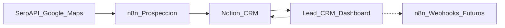

# Integraciones

## Visión general



## Notion

### Responsabilidad

Notion es la fuente de verdad. Leads_CRM:

- lee páginas de la base;
- actualiza propiedades;
- archiva registros;
- escribe el overflow de notas en bloques;
- registra actividad en bloques;
- intenta crear comentarios para las acciones relevantes.

### Identificadores

- Base: `Leads Asesorías Valencia`
- Database ID: `ed07cdd4c5424f9a8b8ebd73e358c6cd`
- Data Source ID: `27fefc608dfd43569465582d3c49d99f`
- View ID: `3d6c7fabc5824158b2d31a969dc1d001`
- URL de usuario: [abrir tabla en Notion](https://app.notion.com/p/ed07cdd4c5424f9a8b8ebd73e358c6cd?v=3d6c7fabc5824158b2d31a969dc1d001)

Los IDs no son secretos. `NOTION_TOKEN` sí lo es.

Mover la tabla a la página `DB notion` no cambió el Database ID ni el Data Source ID. El parámetro `v` identifica únicamente la vista visual y no debe usarse para `dataSources.query`.

### Propiedades requeridas

El mapper espera exactamente estos nombres:

- `Empresa`: title
- `Web`: url
- `Correo General`: email
- `Correo Comercial`: email
- `Correo Gerente`: email
- `Teléfono`: phone_number
- `Dirección`: rich_text
- `CP`: rich_text
- `Ciudad`: rich_text
- `Provincia`: select
- `Empleados`: number
- `LinkedIn`: url
- `Servicios`: multi_select
- `Estado`: select
- `Última actualización`: date
- `Fecha de descubrimiento`: date
- `Observaciones`: rich_text
- `Asunto email`: rich_text
- `Email generado`: rich_text
- `Lead Score`: number
- `Gerente`: rich_text
- `Cargo`: rich_text
- `Confianza`: select
- `Software`: rich_text
- `Origen`: rich_text
- `Último contacto`: date
- `Próximo seguimiento`: date
- `Favorito`: checkbox
- `Análisis IA`: rich_text

No crear `Tags` ni `Responsable` en v1.

### Estados

`Estado` debe contener exclusivamente:

1. Nuevo
2. Pendiente revisar
3. Validado
4. Email preparado
5. Email enviado
6. Respondió
7. Reunión
8. Cliente
9. Descartado

El código puede leer temporalmente `Pendiente`, `Contactado` y `Contratado`, pero nunca debe volver a escribirlos.

### Cuerpo de página

El cuerpo se reserva para:

- encabezado `Notas` y bloques con el excedente de `Observaciones`;
- encabezado `Actividad` y eventos de Leads_CRM.

No renombrar esos encabezados manualmente: el parser los usa como delimitadores.

### Límites y comportamiento

- Las consultas usan `dataSources.query` con páginas de 100 resultados.
- Los scripts de Next.js arrancan Node con `--use-system-ca` para confiar en el almacén de certificados de Windows sin desactivar la validación TLS.
- Las escrituras actualizan `Última actualización`.
- `Observaciones` se divide a los 2000 caracteres.
- El archivo se realiza mediante `pages.update({ archived: true })`.
- Las acciones masivas ejecutan escrituras secuenciales.
- Los comentarios son best-effort: un error de permisos no cancela la actualización del lead.

## n8n

### Workflow actual

El workflow inspeccionado se llama `Leads Asesorias Valencia`.

Su flujo actual:

```mermaid
flowchart LR
  Trigger[Manual_o_Semanal] --> Config[Config_busqueda]
  Config --> Maps[SerpAPI_Maps]
  Maps --> Normalize[Normalizar]
  Normalize --> Existing[Leer_Notion]
  Existing --> Dedupe[Filtrar_duplicados]
  Dedupe --> Website[Leer_web]
  Website --> Extract[Groq_extrae_ficha]
  Extract --> Score[Calcular_score]
  Score --> Email[Groq_redacta_email]
  Email --> Save[Crear_en_Notion]
```



Características:

- búsqueda en Google Maps mediante SerpAPI;
- radio aproximado de 30 km alrededor de Valencia;
- exclusión de grandes consultoras;
- deduplicación exacta por nombre, dominio y teléfono;
- extracción desde la web;
- estimación de empleados;
- generación de email;
- creación del lead en Notion.

### Estado de entrada

El estado acordado es `Pendiente revisar`.

Si una versión antigua del workflow sigue escribiendo `Pendiente`, el mapper lo leerá correctamente, pero conviene actualizar n8n para escribir el valor nuevo.

### Divergencia de empleados

El workflow inspeccionado utiliza 3–10 empleados. El ICP estratégico documentado en `Nicho` utiliza 5–30. Esta configuración debe decidirse y alinearse en n8n; Leads_CRM admite ambos mediante filtros.

### Webhooks

Leads_CRM mapea tres automatizaciones (Settings / Automations). Las variables nuevas tienen alias legacy:

```dotenv
N8N_BASE_URL=
N8N_API_KEY=
N8N_WEBHOOK_LEAD_CREATED=
N8N_WEBHOOK_LEAD_UPDATED=
N8N_WEBHOOK_LEAD_ANALYZED=
# alias
N8N_WEBHOOK_BUSCAR_LEADS=
N8N_WEBHOOK_ANALIZAR_LEAD=
N8N_WEBHOOK_GENERAR_EMAIL=
N8N_WEBHOOK_EJECUTAR=
```

La capa está preparada (`N8nClient.triggerWebhook` + métodos `notifyLeadCreated/Updated/Analyzed`), pero no se añadieron triggers al workflow. No rellenes URLs hasta que existan endpoints n8n protegidos. Settings puede guardar overrides en `data/settings.local.json` (gitignored); el navegador solo ve previews enmascarados.

## SerpAPI

SerpAPI es la herramienta vigente de búsqueda externa porque coincide con la implementación real de n8n.

Variable reservada:

```dotenv
SERPAPI_API_KEY=
```

El cliente de servidor está preparado en `src/lib/serpapi/client.ts`. Añade siempre la clave desde el servidor y nunca la envía al navegador. La búsqueda todavía no está conectada a una pantalla de Leads_CRM.

Las notas históricas mencionan SearchAPI.io. Esa referencia no representa la implementación vigente.

## IA

El workflow actual usa Groq para:

- extraer una ficha estructurada desde el contenido web;
- redactar el borrador de email.

El cliente TypeScript oficial está configurado en `src/lib/ai/groq-client.ts` con streaming y llamadas no streaming. Sus valores por defecto equivalen a la configuración acordada:

```dotenv
GROQ_API_KEY=
GROQ_MODEL=openai/gpt-oss-120b
GROQ_TEMPERATURE=1
GROQ_MAX_COMPLETION_TOKENS=2048
GROQ_TOP_P=1
GROQ_REASONING_EFFORT=medium
```

La acción de análisis de dolores todavía no está implementada en la UI. Cuando se añada, su salida se guardará en `Análisis IA` y debe separar evidencia, inferencia y especulación.

## Variables de entorno

Configuración mínima:

```dotenv
NOTION_TOKEN=
NOTION_DATABASE_ID=ed07cdd4c5424f9a8b8ebd73e358c6cd
NOTION_DATA_SOURCE_ID=27fefc608dfd43569465582d3c49d99f
AUTH_DISABLED=true
```

Integraciones futuras:

```dotenv
GROQ_API_KEY=
GROQ_MODEL=openai/gpt-oss-120b
AI_PROVIDER=groq
SERPAPI_API_KEY=
N8N_BASE_URL=
N8N_API_KEY=
N8N_WEBHOOK_LEAD_CREATED=
N8N_WEBHOOK_LEAD_UPDATED=
N8N_WEBHOOK_LEAD_ANALYZED=
N8N_WEBHOOK_BUSCAR_LEADS=
N8N_WEBHOOK_ANALIZAR_LEAD=
N8N_WEBHOOK_GENERAR_EMAIL=
N8N_WEBHOOK_EJECUTAR=
```

## Seguridad

- Mantener `.env.local` fuera de Git.
- No usar variables `NEXT_PUBLIC_*` para tokens.
- No mostrar valores secretos en Settings (solo flags y últimos 4 caracteres).
- Los overrides de la UI se guardan en `data/settings.local.json`, fuera de Git.
- Restringir los webhooks n8n antes de habilitarlos.
- Mantener `AUTH_DISABLED=true` solo mientras la aplicación se use localmente.
